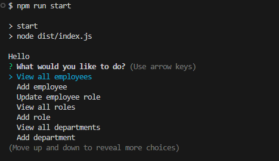

# Employee Tracker

## Description

This is a command-line application used for employee tracking. Technologies used are PostgreSQL, Node.js and Inquirer. This app demonstrates database management, updates and manipulation. When the app is launched it'll prompt a list of actions that can be selected. Users can view employees, add new employees, update employee roles, add new roles, view departments and add new departments.

Development of this app helped me to better understand my knowledge of how to use/implement SQL databases. Using Node.js and Inquirer in this app helped me to better understand their applications and uses.

## Table of Contents

- [Installation](#installation)
- [Usage](#usage)
- [Credits](#credits)

## Installation

When first starting this application run an 'npm i' to install all necessary packages in the command-line. After all packages are installed run the command 'npm run build' to build the application with the compiler. Once everything has been installed and built, run the command 'npm run start' to start the app.

## Usage

Below is a link to a walkthrough video demonstrating how the app works:

Walkthrough Video: https://drive.google.com/file/d/18H-VCGviSBG-1V0R9ci5XKtgm7Vfg1ZE/view?usp=sharing

When the app is launched in the command-line, a prompt will appear as such.

When selecting one of the viewing options, it will display the table in the command-line.

When using an add option, questions will prompt and take in responses to add to database.

## Credits

Below is my GitHub profile. Any suggestions to improve functionality and code, feel free to reach out to me!

GitHub: https://github.com/AVue00
